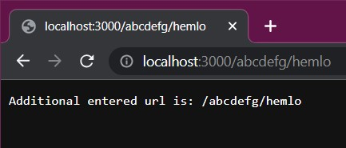

# Reading The Query String
- We use the `http.IncomingMessage` (request) object to access the URL requested.
- The function passed in `createServer()` has an argument `req` object which has a property `url` that holds the tbe part of the URL after the domain name.

```javascript
const http= require('http');

const server= http.createServer((req, res)=> {
    res.writeHead(200, {'Content-Type':'text/plain'});
    res.end(`Additional entered url is: ${req.url}`);
}).listen(3000, ()=> {
    console.log("Server is running now...");
});
```
- On running this file and entering any message after localhost:3000, we get:

    ;

    **NOTE:** We have to use '/' in order to gice additional path in the url.

# Parsing The Query

- We need to use the `url` module.

    ```
    const url= require('url');
    ```
- The url module has a function parse() which takes 3 arguments:
    - **urlString:**   
        It holds the URL string which needs to parse.
    - **parseQueryString:**  
        - It is a boolean value (Default value= false).  
        - If it set to true then the `query` property will be set to an object returned by the querystring module’s parse() method.  
        - If it set to false then the `query` property on the returned URL object will be an unparsed, undecoded string.

    - **slashesDenoteHost:** (Usually not used)  
        - It is a boolean value (Default value= false).  
        - If it set to true then the first token after the literal string // and preceding the next / will be interpreted as the host.  
        - For example: //geeksforgeeks.org/web-technology contains the result  
        {host: ‘geeksforgeeks.org’, pathname: ‘/web-technology’} rather than {pathname: ‘//geeksforgeeks.org/web-technology’}.

- The url.parse() method returns an object with each part of the address as properties.

    For Example: 

    ```javascript
    var adr = 'http://localhost:8080/default.htm?year=2017&month=february';
    var q = url.parse(adr, true);

    console.log(q.host); //returns 'localhost:8080'
    console.log(q.pathname); //returns '/default.htm'
    console.log(q.search); //returns '?year=2017&month=february'

    var qdata = q.query; //returns an object: { year: 2017, month: 'february' }
    console.log(qdata.month); //returns 'february'
    ```

- Another Example:
    ```javascript
    const q= url.parse(req.url, true).query;
    console.log(`name: ${q.name}`);
    console.log(`age: ${q.age}`);
    console.log(`month: ${q.month}`);
    console.log(`sex: ${q.sex}`);
    
    //can also do the below
    //console.log(q.name + " " + q.age);
    ```

    For the url:   
    ```
    http://localhost:3000/customPath?name=Anurag&age=19&Sex=m&desg=student&month=july&sex=F
    ```  
    We get the output in the terminal as:

     
    
    **NOTE:** The url.path() is `depricated` now.
    
