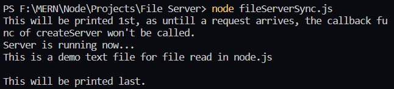
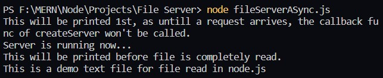
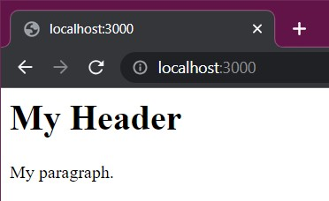
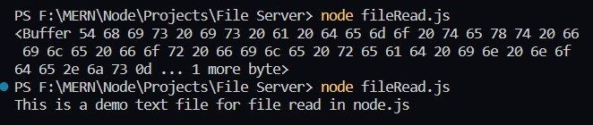

# Node.js as a File Server

The Node.js file system module allows us to work with the file system on our computer.

For this we use the `fs` (File System) module.

- This module allows us to perform the following:
    - Create Files
    - Read Files
    - Update Files
    - Delete Files
    - Rename Files

# Reading Files

- We have two methods:
    1. ### **Synchronous Read**  
        - blocking type
        - meaning untill the file is read, all parallel processes are stopped.
        - carried out by readFileSync()

    2. ### **Asynchronous Read**
        - non-blocking type
        - meaning commands execution can carry on parallelly while the file is being read.
        - carried out by readFile()

- ### fs.readFileSync(filePath, options)

    - **filepath:** path to the file which is to be read.

    - **options:** an object consisting of encoding and flag (default= null).  It is optional.

    - **encoding** default= `'utr8'` (Needs to be included, else not read in readable format).  

    - **flag:** default= 'r' (Indicates of operations in the file).

    - **This method returns the data that is read.**

        Example: 

        Let a file `demo.txt` contain:

        ```
        This is a demo text file for file read in node.js

        ```

        ```javascript
        const http= require('http');
        const fs= require('fs');

        const server= http.createServer((req, res)=> {
            data= fs.readFileSync('demo.txt', {encoding: 'utf8', flag: 'r'});
            console.log(data);
            console.log("This will be printed last.");
            res.end("File Read using readFileSync()!");
        }).listen(3000, ()=> {
            console.log("Server is running now...");
        });
        
        console.log("This will be printed 1st, as untill a request arrives, the callback func of createServer won't be called.");
        ```

        We get the output int the terminal as:
        
        


- ### fs.readFile(filePath, encoding, callback())

    - **filepath:** path to the file which is to be read.

    - **encoding** default= `'utr8'` (Needs to be included, else not read in readable format).  

    - **callback:** Function that will be executed once the file is read.
        ```javascript
        (err, data) => {
            if(err)
                console.log("error");
            else
                console.log(data);
        }
        ```
    

        **NOTE:** Callback fuctions are executed only when the event they're associated with, occurs.


    - **This method returns the data that is read/error if any.**

        Example: 

        Let a file `demo.txt` contain:

        ```
        This is a demo text file for file read in node.js
        
        ```

        ```javascript
        const http= require('http');
        const fs= require('fs');

        const server= http.createServer((req, res)=> {
            fs.readFile('demo.txt', 'utf8',  (err, data)=> {
                if(err)
                    console.log("Error occured :'/");
                else
                    console.log(data);
            });
            console.log("This will be printed before file is completely read.");
            res.end("File Read using readFile()!");
        }).listen(3000, ()=> {
            console.log("Server is running now...");
        });
        console.log("This will be printed 1st, as untill a request arrives, the callback func of createServer won't be called.");

        ```

        We get the output int the terminal as:
        
        

    - We get the output `This will be printed before file is completely read.` while the file is being read as this is asynchronous (non blocking) method.

    - We can also read .html files as send the data back using `res.write()` or `res.end()`.

        Example:

        Let a file `demo.html` contain:

        ```html
        <html>
        <body>
        <h1>My Header</h1>
        <p>My paragraph.</p>
        </body>
        </html>
        ```
        Node.js Code:

        ```javascript
        const server= http.createServer((req, res)=> {
            fs.readFile('demo.html', 'utf8', (err, data)=> {
                if(err)
                    console.log("Error occured :'/");
                else
                    res.write(data);   
                    res.end();  
            });
            // res.end("File Read using readFile()!");
        }).listen(3000, ()=> {
            console.log("Server is running now...");
        });
        ``` 
        For which we get the output: 

        


        **NOTE:** If `'utf8'` is not used, we need to use the `.toString()` on the final data read.

        Example:
        
        ```javascript
        fs.readFile('demo.txt', (err, data)=>{
            if(err)
                console.log(err);
            console.log(data.toString());
        });
        ```

        Output without and with `toString()`:
        
        

- we can send statusCode as `404` in case of err in file reading.

### Sources

- https://www.geeksforgeeks.org/node-js-file-system/
